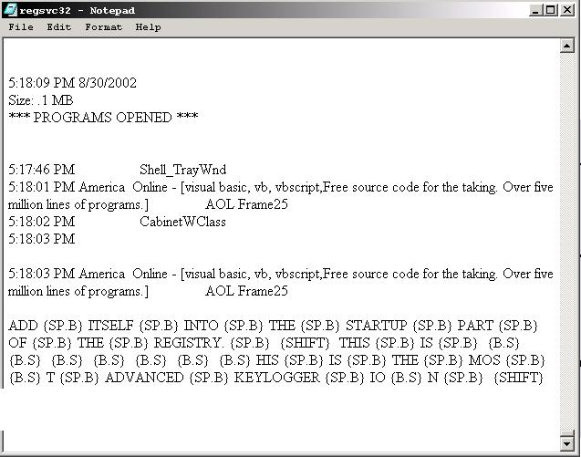



## \_A SUPREME MASTER KEYLOGGER \- UPDATED\*\*\*\*\*\*\*\*\*

### Description

----

READ ALL! UPDATES ON BOTTOM *** This is the best and most advanced keylogger you will ever use. Not only does it log normal keys, it logs the keys that most keyloggers miss, such as the keys on the num pad and enter,backspace,alt,ctrl,shift,mouse buttons, EVERYTHING (I mean every key!!!!!!), all of the F#s.NOt only does it do that, it will detect all of the open window names and save that and the text that was typed into that window all in a hidden DLL!!!!(open the dll with Notepad) This is awesome, it uses not even 1% of resources, and it will automatically add itself into the startup part of the registry. It will also give you the time and date that it was entered, the window, and the size of the file(dll). You can never see the window, it justs runs hidden until your comp is shut down, then it will start as soon as Windows starts. All you have to do is open the dll to see whatever you want. It's also hidden from the CTRL ALT DELETE screen(2000,XP only) All of this and it's only 40k. It also has the classic dos style icon so you can put it in the windows directory to disguise it.*** UPDATED *** updates:

1 Will not save empty logs to the dll. (If the comp is Idle for a long time, the app won't keep saving empty logs. It will only save when an action is performed :-))

2 Better file sizer

3 Now takes up less ram.

4 NOW INCORPERATES THE SETTINGS.INI FILE! What this does is that it will name the dll (that has the info) and the registry key what you enter as a name. By default it is "regsvc32", but if you entered (for example) 'muscapp32" or something else, it will now save the dll to that name. This is great because if someone found out the dll file and is taking the info as well as you (or deleting the dll), the app will now save to the renamed dll! SWEEEEEETTT!!!!

()If the settings.ini is deleted or something like that, my app will just default to regsvc32 instead of crashing!!!!!!!!!!!

()Hides itself in WIndows 9x, 2000 and XP! KEYWORDS: Keylogger Key Logger GetAsyncKeyState VK_ DLL INI Files Registry Startup Advanced Master Supreme Jaime Muscatelli
 
### More Info
 

             |
---                |---
**Submitted On**   |2002-12-27 17:04:26
**By**             |[Jaime Muscatelli](https://github.com/Planet-Source-Code/PSCIndex/blob/master/ByAuthor/jaime-muscatelli.md)
**Level**          |Advanced
**User Rating**    |3.8 (64 globes from 17 users)
**Compatibility**  |VB 6\.0
**Category**       |[Complete Applications](https://github.com/Planet-Source-Code/PSCIndex/blob/master/ByCategory/complete-applications__1-27.md)
**World**          |[Visual Basic](https://github.com/Planet-Source-Code/PSCIndex/blob/master/ByWorld/visual-basic.md)
**Archive File**   |[A\_SUPREME\_153832222003\.zip](https://github.com/Planet-Source-Code/jaime-muscatelli-a-supreme-master-keylogger-updated__1-38500/archive/master.zip)

